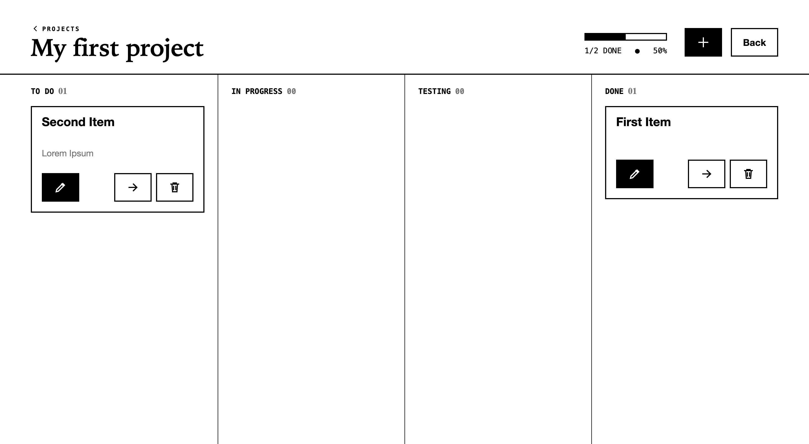
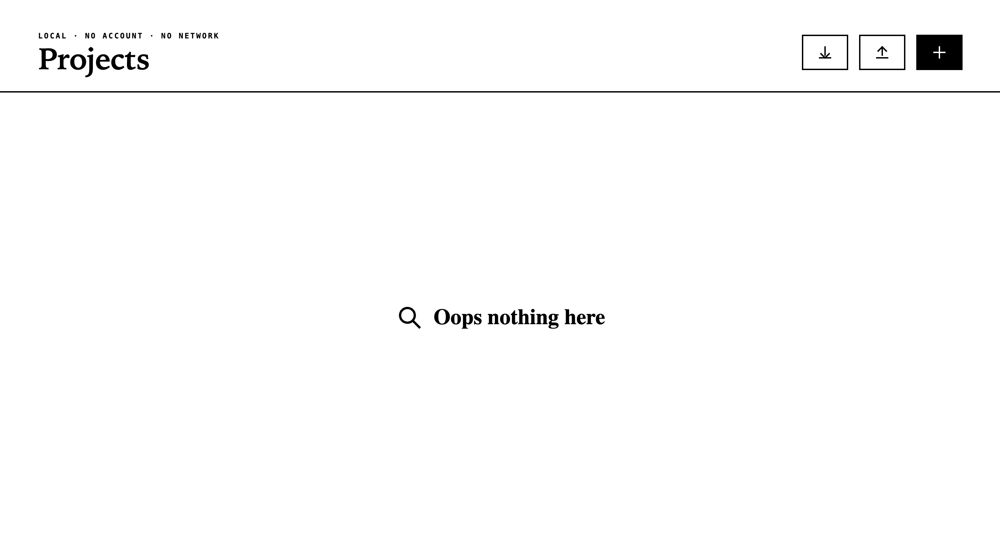
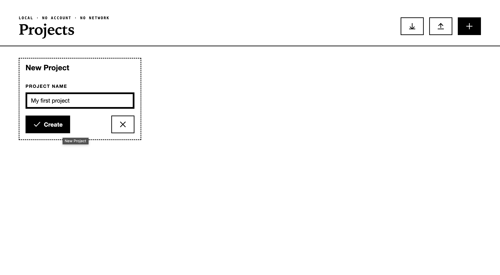
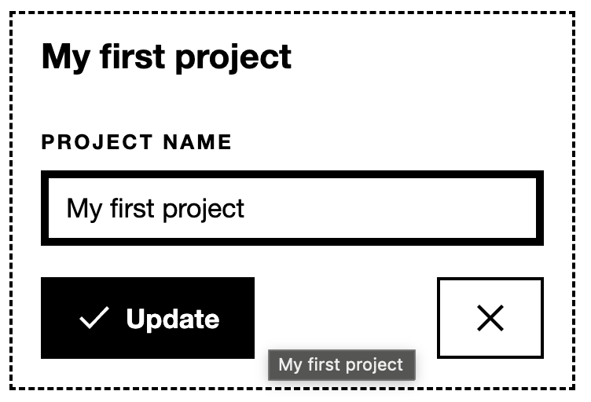
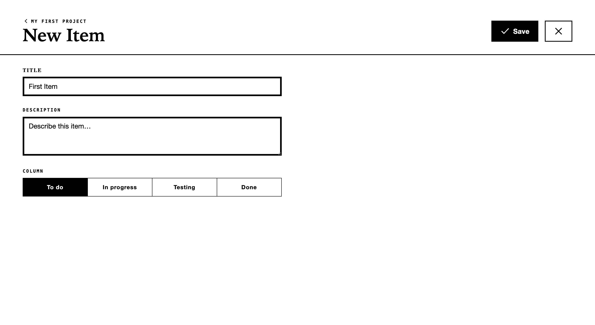
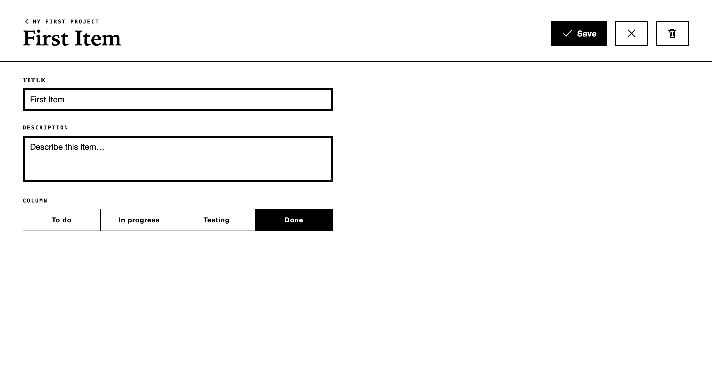
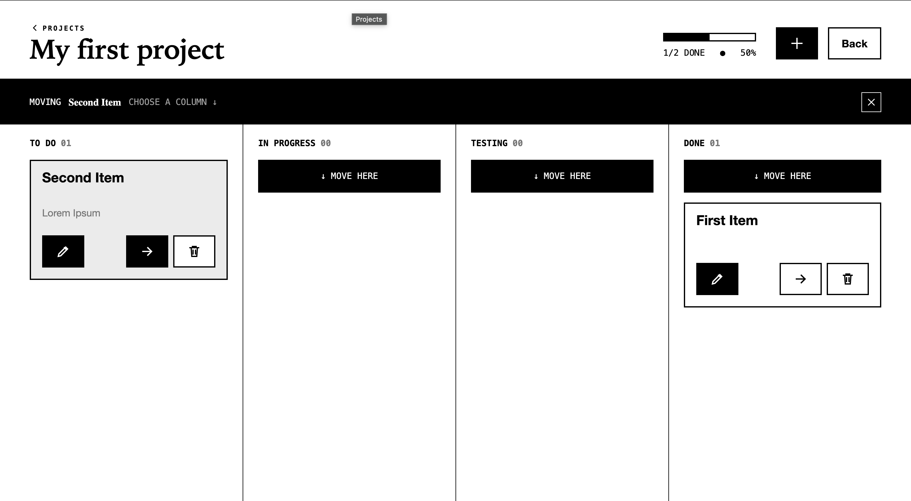
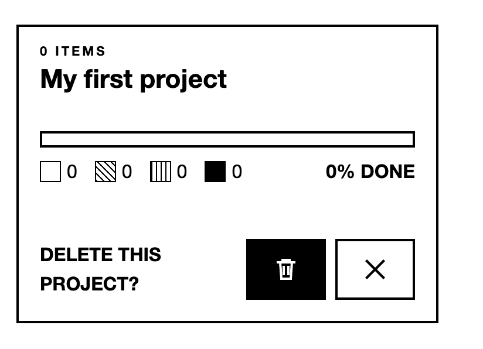

# PaperFlow (E-Ink Project Manager)

> **A distraction-free, local-first project management Progressive Web App built specifically for e-ink tablets and paper-like displays.**

[](https://developer.mozilla.org/en-US/docs/Web/Progressive_web_apps)
[](https://developer.mozilla.org/en-US/docs/Web/API/IndexedDB_API)
[](https://epaper-components.dev)
[](LICENSE)


## Table of Contents

- [PaperFlow (E-Ink Project Manager)](#paperflow-e-ink-project-manager)
  - [Table of Contents](#table-of-contents)
  - [Overview](#overview)
  - [Screenshots](#screenshots)
  - [Key Features](#key-features)
  - [Tech Stack](#tech-stack)
  - [Quickstart](#quickstart)
    - [Prerequisites](#prerequisites)
    - [Run Locally](#run-locally)
  - [Installation on E-Ink Devices](#installation-on-e-ink-devices)
  - [Local-First Architecture](#local-first-architecture)
  - [Development \& Testing](#development--testing)


## Overview

**PaperFlow** is a lightweight project management tool engineered from the ground up for low-refresh-rate, high-contrast e-paper displays (such as Onyx Boox, Kindle Fire, or custom e-ink setups).

It allow users to create their projects and tickets (items) and keep track of them accordingly in a distraction free way. My first e-ink orientated project. Its intentional simple and focussed on the interface for such display technology.


## Screenshots

|                                                                                             |                                                                                                  |
| :-----------------------------------------------------------------------------------------: | :----------------------------------------------------------------------------------------------: |
|          **Project Overview** <br>            |                **No Projects Yet** <br>                  |
|      **Create a New Project** <br>        | **Update an Existing Project** <br>  |
|           **Create a New Item** <br>            |        **Edit an Existing Item** <br>          |
| **Move Items Across Columns** <br>  |               **Delete a Project** <br>                |


## Key Features

- **E-Ink Optimized UI:** Uses high-contrast black-and-white layouts, sharp borders, and zero unnecessary animations to prevent display ghosting and refresh lag via `epaper-components.dev`.
- **100% Local & Private:** All project data, tasks, and notes reside solely inside your browser's IndexedDB. No servers, no telemetry, no subscription fees.
- **Offline-First PWA:** Full service worker caching enables true offline functionality—install it directly onto your Android/e-ink tablet home screen.
- **Project & Item Management:** Create, rename, and delete projects; create and edit items within a project and move them across `To Do`, `In Progress`, `Testing`, and `Done` columns.
- **Lightweight & Fast:** Built with React 19 and React Router for instant view transitions without heavy bundle overhead.


## Tech Stack

| Category                 | Technology                                                                                                      | Purpose                                     |
| :----------------------- | :-------------------------------------------------------------------------------------------------------------- | :------------------------------------------ |
| **Framework**            | [React 19](https://react.dev/)                                                                                  | Core UI library                             |
| **Routing**              | [React Router](https://reactrouter.com/)                                                                        | Client-side routing                         |
| **UI Components**        | [Epaper Components](https://epaper-components.dev)                                                              | High-contrast, e-ink tailored UI primitives |
| **Data Persistence**     | [Dexie.js](https://dexie.org/) over [IndexedDB](https://developer.mozilla.org/en-US/docs/Web/API/IndexedDB_API) | In-browser, local-first database            |
| **PWA / Build**          | [Vite](https://vitejs.dev/) + [Vite PWA Plugin](https://vite-pwa-org.netlify.app/)                              | Service worker, caching, fast dev server    |
| **Linting / Formatting** | [Biome](https://biomejs.dev/)                                                                                   | Linting and code formatting                 |
| **Testing**              | [Vitest](https://vitest.dev/) + [Testing Library](https://testing-library.com/)                                 | Unit/component tests                        |
| **Language**             | [TypeScript](https://www.typescriptlang.org/)                                                                   | Static typing                               |

## Quickstart

### Prerequisites

- **Node.js** v20 or higher
- **npm**

### Run Locally

```bash
# 1. Clone the repository
git clone https://github.com/AlexisRoe/project-management-for-e-ink
cd paperflow

# 2. Install dependencies
npm ci

# 3. Start development server
npm run dev

```

Navigate to `http://localhost:9001` in your browser.


## Installation on E-Ink Devices

Since PaperFlow is a Progressive Web App, you do not need an app store:

1. Open your e-ink device browser (e.g., Neoreader/E-ink Browser on Boox, Kiwi Browser, or Chrome).
2. Navigate to your deployed URL (or local network IP).
3. Tap **Menu** (⋮) ➔ **Add to Home Screen** / **Install App**.
4. Open PaperFlow directly from your app drawer as a fullscreen native app.

## Local-First Architecture

PaperFlow operates with **zero server dependencies**:

* **Storage Engine:** All CRUD operations go through [Dexie.js](https://dexie.org/), which wraps IndexedDB with transactional queries.
* **No Network Lock-In:** Network requests are never attempted for core app features.


## Development & Testing

```bash
# Run linter
npm run lint

# Run tests
npm run test

# Run tests with coverage
npm run coverage

# Build production bundle & PWA assets
npm run build

# Preview production build locally
npm run preview

```

When contributing UI changes, ensure all new components use high-contrast styling (`#000000` and `#FFFFFF`) and avoid CSS transitions/animations (`transition: none !important`) to maintain e-ink compatibility.
